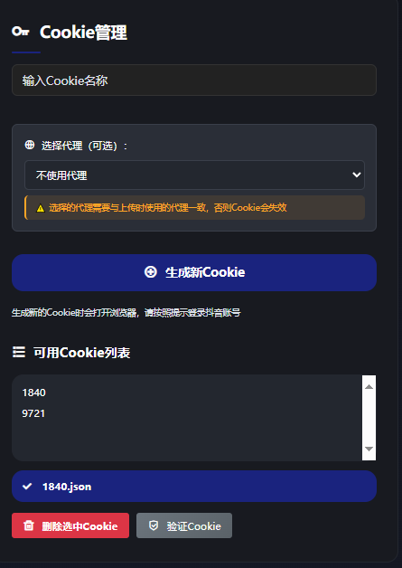
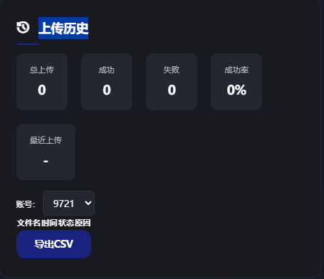
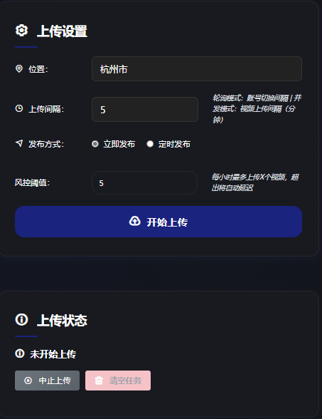
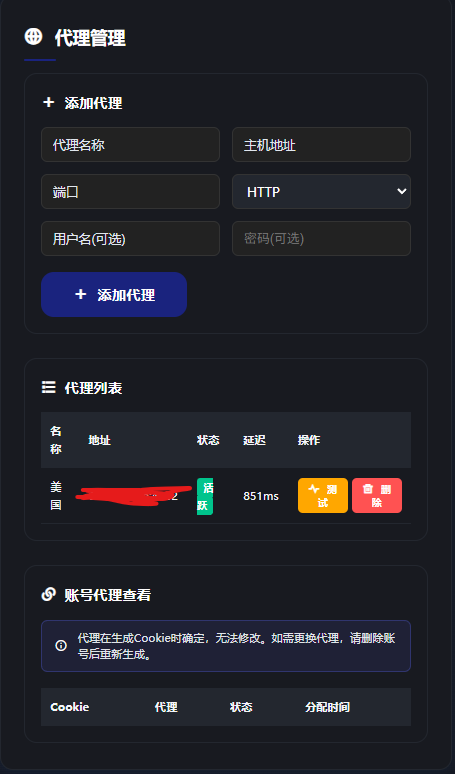
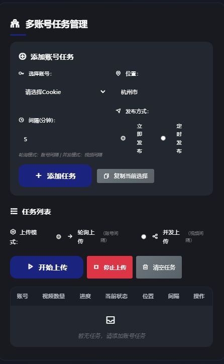
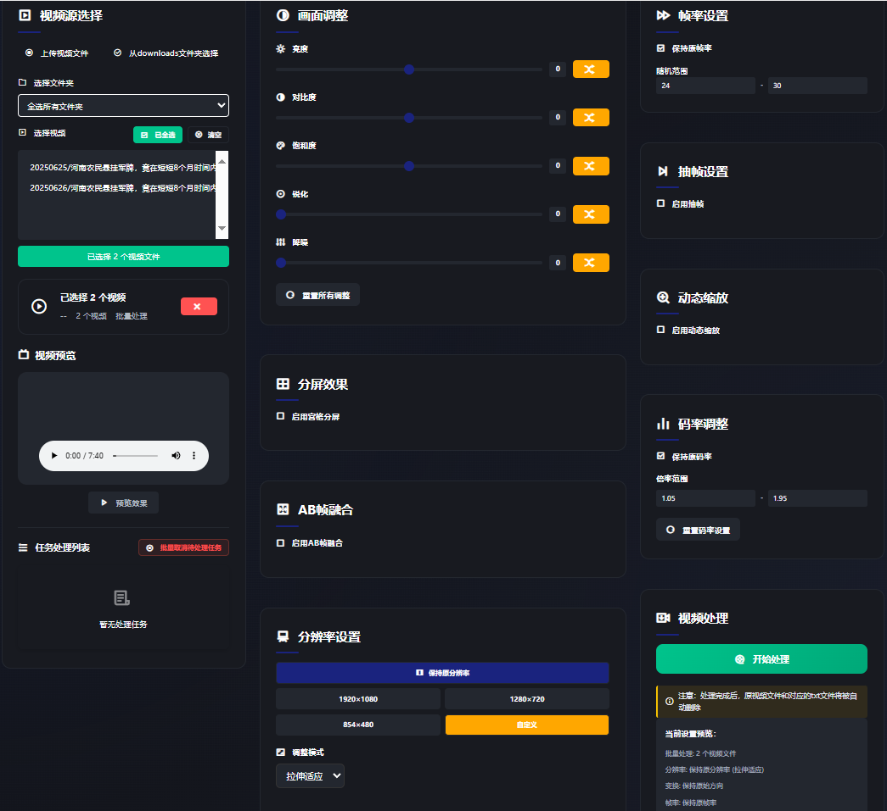
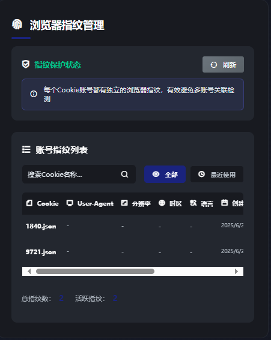
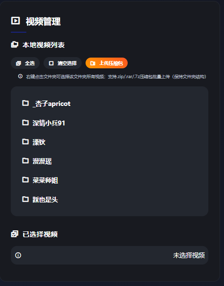
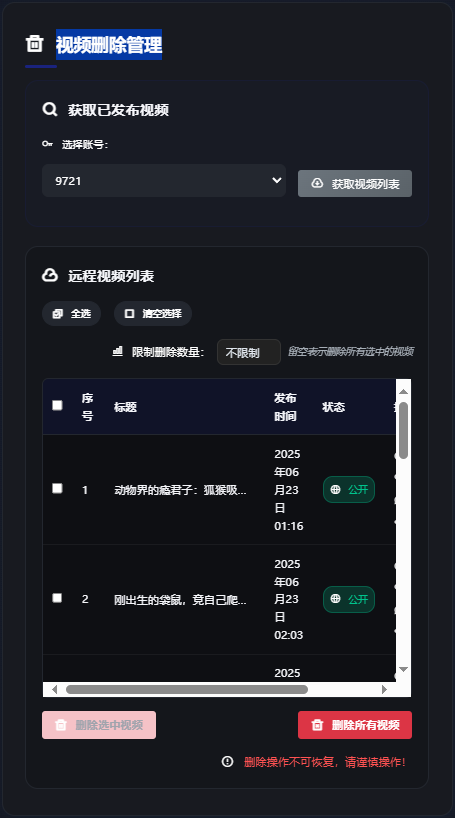
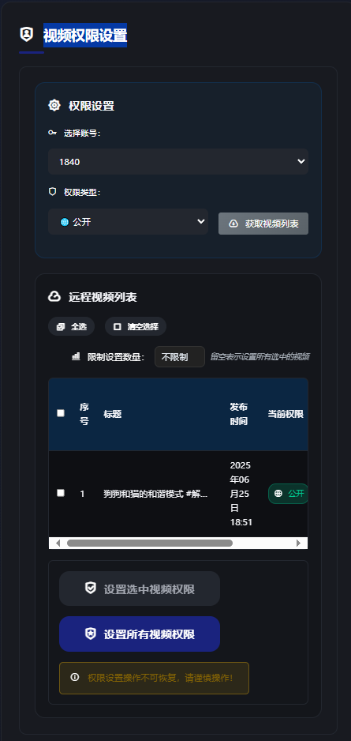

# 项目功能说明

## 项目简介

本项目是一款面向抖音（Douyin）与 TikTok 平台的视频、图集、直播、评论等多类型数据采集与批量下载工具，支持多账号管理、自动化上传、代理与指纹管理、智能视频编辑等丰富功能。项目完全开源，适用于内容创作者、数据分析师及自动化运营场景。

---

## 主要功能（详细版）

### 1. 下载抖音/TikTok无水印视频、图集、实况、动图
- 支持输入单个或批量视频/图集链接，自动识别内容类型（视频、图集、实况动图等）。
- 自动解析最高画质的无水印下载地址，支持断点续传，避免网络中断导致的重复下载。
- 支持按作者昵称、作品标题等自动归档文件夹，文件命名安全且可自定义。
- 支持多线程下载，极大提升批量任务效率。
- 下载过程自动校验文件完整性，防止损坏。
- 支持下载动态/静态封面图，便于后续内容管理和二次创作。

### 2. 支持账号发布、喜欢、收藏、合集等多类型作品批量下载
- 支持通过配置文件批量导入多个账号、合集、收藏夹等信息，自动遍历并下载所有作品。
- 可自定义筛选条件（如发布时间区间、作品类型等），精准采集目标内容。
- 支持增量下载，自动跳过已下载内容，节省带宽和存储。
- 支持多账号并发批量任务，任务进度实时可查，失败自动重试。
- 支持导出下载记录，便于后续统计和溯源。

### 3. 采集评论、账号、热榜、搜索等详细数据
- 支持采集每个作品的全部评论，包括评论内容、用户昵称、IP归属地、点赞数、回复数等详细字段。
- 支持采集账号主页信息、粉丝数、作品数、签名、头像等。
- 支持采集抖音热榜、关键词搜索结果，便于热点追踪和数据分析。
- 所有采集数据可导出为CSV/XLSX/SQLite等格式，方便二次分析和可视化。
- 评论采集支持分页、断点续采，适合大体量数据场景。

### 4. 支持多账号批量任务、Cookie智能管理、代理绑定
- 支持为每个账号分配独立Cookie和代理，账号间完全隔离，提升安全性。
- Cookie支持手动粘贴、浏览器自动获取，失效自动提醒，保障任务不中断。
- 多账号任务支持轮询或并发上传/下载，支持断点续传和失败重试。
- 任务状态实时监控，支持任务暂停、恢复、删除等操作。
- 代理支持HTTP/HTTPS/SOCKS5多协议，支持账号与代理一一绑定，防止IP被封。

### 5. 支持Web UI、终端、API多种交互模式
- 提供响应式Web UI，支持桌面和移动端，操作直观易用。
- 支持命令行终端交互，适合自动化脚本和高级用户。
- 提供标准化API接口，便于与其他系统集成或二次开发。
- 支持扫码登录、验证码输入等可视化操作，降低使用门槛。

### 6. 智能视频编辑与批量上传，支持断点续传
- 内置智能视频编辑器，支持视频剪辑、合成、批量处理等功能。
- 批量上传支持定时发布、账号轮换、风控智能规避，自动跳过已上传内容。
- 上传任务支持断点续传，随时中断和恢复，适合大批量内容分发。
- 上传历史完整记录，便于追踪和统计。

### 7. 数据导出支持CSV/XLSX/SQLite多种格式
- 所有采集和下载数据均可一键导出，支持主流数据分析工具直接读取。
- 支持自定义导出字段和格式，满足不同业务需求。

### 8. 支持浏览器指纹与代理管理，提升账号安全性
- 支持为每个账号分配独立浏览器指纹，模拟真实用户环境，降低被平台风控风险。
- 代理管理支持批量添加、测试、分配，状态实时监控，异常自动告警。

### 9. 支持自定义筛选、增量下载、自动跳过已下载内容
- 支持自定义筛选规则（如发布时间、内容类型、关键词等），精准采集目标内容。
- 增量下载机制自动识别已下载内容，避免重复采集。
- 支持自定义文件大小上限，防止异常大文件占用存储。

### 10. 支持多线程下载、文件完整性校验
- 下载任务自动分配多线程，极大提升下载速度。
- 每个文件下载后自动校验完整性，发现损坏自动重试。

### 11. 支持局域网远程访问与服务器部署
- 支持将服务部署在本地或服务器，局域网内多端访问。
- 支持Docker一键部署，环境隔离，运维简单。

---

## 特色功能模块

### 1. Cookie 管理

- 支持手动粘贴、浏览器自动获取 Cookie
- Cookie 智能检测与失效自动提醒
- 支持为每个账号分配独立 Cookie，保障多账号隔离和安全

### 2. 上传历史管理

- 记录所有上传任务历史，便于追踪与统计
- 可查看每个账号、每个视频的上传状态、时间、结果

### 3. 上传设置

- 支持定时发布、自动轮换账号、风控智能规避
- 可自定义上传间隔、定时任务、代理分配等参数

### 4. 代理管理

- 支持 HTTP/HTTPS/SOCKS5 多种代理类型，账号与代理绑定
- 支持批量添加、测试、分配代理，状态实时监控
- 代理分配与Cookie绑定，提升账号安全性

### 5. 多账号任务管理

- 支持多账号并发任务，Cookie 隔离，账号状态监控
- 支持批量任务的暂停、恢复、删除、断点续传

### 6. 智能视频编辑器

- 提供视频剪辑、合成、批量处理等智能编辑功能
- 支持多种视频格式导入导出，适合内容二次创作

### 7. 浏览器指纹管理

- 管理与模拟浏览器指纹，提升账号安全性与防封能力
- 支持为每个账号分配独立指纹，降低被平台检测风险

### 8. 视频管理

- 支持视频批量管理、标签归类、状态追踪
- 可对视频进行批量操作，如重命名、归档、导出等

### 9. 视频删除管理

- 支持批量删除已上传视频，便于内容合规与运营
- 删除操作有日志记录，防止误删

### 10. 视频权限设置

- 支持批量设置视频公开/私密权限，灵活控制内容曝光
- 可一键切换视频权限，适应不同运营需求

---

## 典型使用场景

- **内容创作者**：批量采集热门视频、自动化上传、智能编辑与管理内容
- **数据分析师**：采集评论、账号、热榜等多维度数据，导出分析
- **新媒体运营**：多账号矩阵管理，自动化内容分发与风控
- **自动化脚本开发者**：通过 API/Web UI 接口集成到自有系统

---
